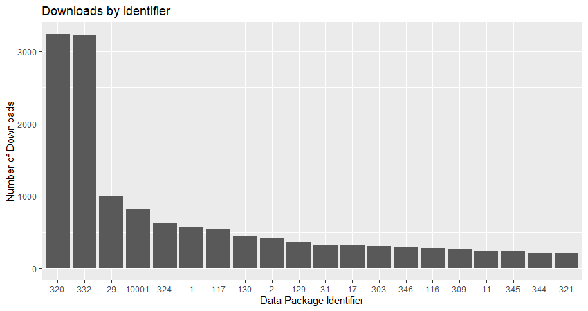
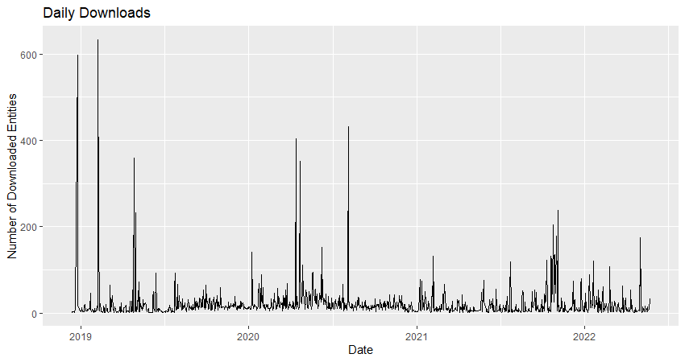

This vignette demonstrates how to query the EDI repository for data package download metrics. These stats may be used in reports or further processed to understand data user behavior. Although EDI makes every effort of accurate reporting, these download data need to be carefully inspected and understood before using.

## Introduction to Download reports

The PASTA Audit service collects information about user-related events that occur in PASTA, including data entity downloads. This information is stored in the Audit Manager's event database and which can be accessed through the `get_audit_report()` command and returns a data frame composed of individual event audit records. Understanding this information is critical to determine the meaning of these events.

Attention needs to be paid to the `user` field, which can be `public` or `robot`. It is also important to know that the `userAgent` field is not required and a user agent can define its own text string to insert or leave blank. However, the `userAgent` provides a lot of interesting information. E.g., it allows a good estimate of downloads being initiated manually through a web browser (e.g., records starting with `Mozilla`) and downloads initiated programmatically (e.g., MATLAB, RStudio, etc.). The user agent `DataONE`, however, is the exception and appears to generate download reports that currently cannot be traced to actual, user generated entity downloads. They should be carefully inspected and cross checked with downloads reported for datasets on the DataONE search interface or filtered out as they seem to include internal management related data access. 

Audit reports query a large database containing millions of records and may take some time to generate. In addition, a report containing a lot of audit records will create a large output, which may be slow to completely download and locally manage. It is best to use query parameters to limit requests.

## Set up the R environment


```{r, eval=FALSE}
library(EDIutils)
library(dplyr)
library(tidyr)
library(ggplot2)
library(lubridate)
```


## Get the Audit Report for Downloaded Data Entities

Accessing the audit report requires authentication.


```{r, eval=FALSE}
login()
#> userID: "my_name"
#> userPass: "my_secret"
```

Setting the query parameters to get the desired audit report:

  - `category` should be 'info' to only see actual downloads from users not bots
  - `serviceMethod` is readDataEntity, i.e., downloads of data entities
  - `resourceID` is a substring of the full URL pattern `https://pasta.lternet.edu/package/data/eml/{scope}/{identifier}/{version}`. In this example we use the scope to get all download records for an LTER site.
  - `fromTime` (ISO format) is important to set to limit the number of records to be processed. Reliable download information with most bot access filtered out are available since about 2019.
  - `toTime` (ISO time format) may be set as well
  - `limit` may be used to limit the number of records
  
For more information on searchable fields see `get_audit_report()` documentation.
  

```{r, eval=FALSE}
# Construct the query
query <- paste(
  "category=info",
  "serviceMethod=readDataEntity",
  "resourceId=knb-lter-ntl",
  "fromTime=2018-12-12T00:00:00",
  "toTime=2022-05-24T00:00:00",
  sep = "&"
)

# Get the report
df_report <- get_audit_report(query)

logout()
```

Filter the records and parse the entityID into scope, identifier, and version. Here robot and DataONE downloads records are filtered out.

```{r, eval=FALSE}
df_results <- df_report %>%
  filter(user != "robot") %>%
  filter(userAgent != "DataONE-Python/3.4.7 +http://dataone.org/") %>%
  filter(nchar(resourceId) > 0) %>%
  separate(entryTime, into = c("date", NA), sep = "T") %>%
  separate(
    resourceId, 
    into = c(NA, NA, NA, NA, NA, NA, "scope", "identifier", "revision", NA), 
    sep = "/"
  )

df_results$date <- ymd(df_results$date)
```

Group and count downloads for each data package for the entire time period.

```{r, eval=FALSE}
df_downloads <- df_results %>%
  group_by(identifier) %>%
  summarise(n = n())
```

Graph the 20 most downloaded data packages.

```{r, eval=FALSE}
top20 <- arrange(df_downloads, desc(n)) %>% slice(1:20)

ggplot(top20, aes(x = reorder(identifier, -n), y = n)) +
  geom_bar(stat = "identity") +
  labs(
    y = "Number of Downloads",
    x = "Data Package Identifier",
    title = "Downloads by Identifier"
  )
```




Count downloads per month.

```{r, eval=FALSE}
df_downloads_per_month <- df_results %>%
  mutate(month = month(date)) %>% 
  group_by(month) %>%
  summarise(n = n())
```

And graph the daily downloads.

```{r, eval=FALSE}
df_downloads_daily <- df_results %>%
  group_by(date) %>%
  arrange(date) %>%
  summarise(n = n())

ggplot(df_downloads_daily, aes(x = date, y = n, group = 1)) +
  geom_line() +
  labs(
    y = "Number of Downloaded Entities",
    x = "Date",
    title = "Daily Downloads"
  )
```


