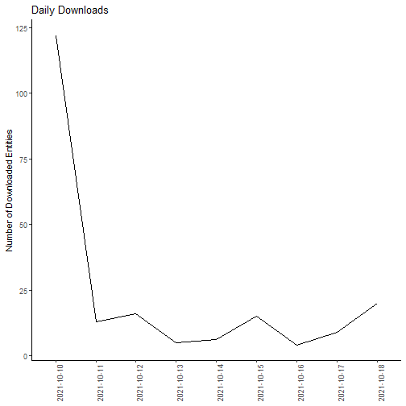

This vignette demonstrates how to query the EDI repository for data package download metrics. These stats may be used in reports or further processed to understand data user behavior.

### Set up the R environment

```r
library(EDIutils)
library(xml2)
library(stringr)
library(dplyr)
#> 
#> Attaching package: 'dplyr'
#> The following objects are masked from 'package:stats':
#> 
#>     filter, lag
#> The following objects are masked from 'package:base':
#> 
#>     intersect, setdiff, setequal, union
library(lubridate)
#> 
#> Attaching package: 'lubridate'
#> The following objects are masked from 'package:base':
#> 
#>     date, intersect, setdiff, union
library(ggplot2)
```

Several EDI API functions return XML, `xml2` is a convenient package to extract desired information and to save returned EML files locally.

### Get the Audit Report for Downloaded Data Entities

Accessing the audit report requires authentication.

In a text editor create the file `.Renviron` with the content:

```{r eval=FALSE}
login()
#> User name: "my_name"
#> User password: "my_secret"
```

Setting the query parameters to get the desired audit report:

  - `category` should be 'info' to only see actual downloads from users not bots
  - `serviceMethod` is readDataEntity, i.e., downloads of data entities
  - `resourceID` is a substring of the full URL pattern `https://pasta.lternet.edu/package/data/eml/{scope}/{datasetID}/{version}`. In this example we use the scope to get all download records for a site
  - `fromTime` (ISO format) is important to set to limit the number of records to be processed. Reliable download information with most bot access filtered out are available since about 2019.
  - `toTime` (ISO time format) may be set as well
  - `limit` may be used to limit the number of records
  
For more information on searchable fields see `get_audit_report()` documentation.
  
```{r eval=FALSE}
# Construct the query
query <- paste("category=info",
               "serviceMethod=readDataEntity",
               "resourceId=knb-lter-ntl",
               "fromTime=2021-10-10T00:00:00",
               "toTime=2021-10-19T00:00:00",
               sep = "&")

# Get the report
report_xml <- get_audit_report(query = query, env = "production")

logout()
```

### Parse the Report

The returned XML has the format:

```xml
<auditReport>
  <auditRecord>
    <oid>115951546</oid>
    <entryTime>2021-10-18T09:27:52</entryTime>
    <category>info</category>
    <service>DataPackageManager-1.0</service>
    <serviceMethod>readDataEntity</serviceMethod>
    <responseStatus>200</responseStatus>
    <resourceId>https://pasta.lternet.edu/package/data/eml/knb-lter-ntl/387/1/c472d5a7ac8a89a12100792e9b5705d3</resourceId>
    <user>public</user>
    <userAgent>null</userAgent>
    <groups/>
    <authSystem>https://pasta.edirepository.org/authentication</authSystem>
    <entryText>Entity Name: EDI_Data_Metadata_JumpingWorms.csv; Object Name: EDI_Data_Metadata_JumpingWorms.csv; Data Format: text/csv</entryText>
  </auditRecord>
</auditReport>

```

Set up the data frame to hold date and packageId

```r
df_results <- data.frame(dl_date = as.Date(character()),
                         dl_scope = character(),
                         dl_datasetID = character(),
                         dl_revision = character())
```


Get the date and packageId


```r
download_date_time <- xml_text(xml_find_all(report_xml, "//entryTime"))

download_data_entity <- xml_text(xml_find_all(report_xml, "//resourceId"))

for (i in 1:length(download_data_entity)) {
  
  
  dl_date <- str_split(download_date_time, "T")[[i]][1]
  dl_entity <- str_split(download_data_entity, "/")[i]
  dl_scope <- dl_entity[[1]][7]
  dl_datasetID <- dl_entity[[1]][8]
  dl_revision <- dl_entity[[1]][9]
  
  df_results_record <- data.frame(dl_date = dl_date, 
                                   dl_scope = dl_scope, 
                                   dl_datasetID = dl_datasetID, 
                                   dl_revision = dl_revision)
  
  df_results <- rbind(df_results, df_results_record)
}
```

Group and count downloads for each data package for the entire time period


```r
df_downloads <- df_results %>%
  group_by(dl_datasetID, dl_scope) %>%
  summarise(n = n())
#> `summarise()` has grouped output by 'dl_datasetID'. You can override using the `.groups` argument.
```

Or count downloads per month


```r
df_downloads_per_month <- df_results %>%
  mutate(dl_month = month(dl_date)) %>% 
  group_by(dl_month) %>%
  summarise(n = n())
```

And graph the downloads


```r
df_downloads_daily <- df_results %>%
  group_by(dl_date) %>%
  arrange(dl_date) %>%
  summarise(n = n())

ggplot(df_downloads_daily, aes(x=dl_date, y=n, group = 1)) +
  geom_line() +
  labs(y = "Number of Downloaded Entities", 
              title = "Daily Downloads") +
  theme(axis.text.x = element_text(angle = 90),
        axis.title.x = element_blank(),
        axis.line = element_line(colour = "black"),
        panel.background = element_rect(fill = "white"))
```



